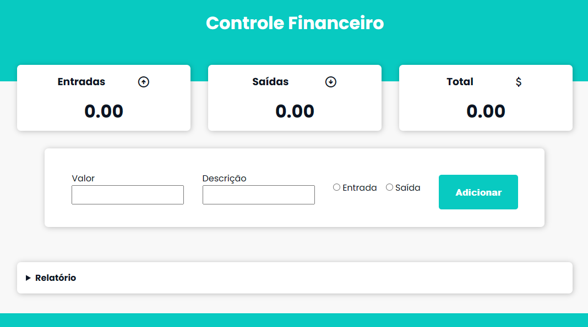

# Controle financeiro
Modo de usar:
1. coloque o valor
2. coloque uma descrição
3. defina se é um valor de entrada ou saída
4. clique no botão 'Adicionar'
5. para ver todos os extratos, clique no relatório logo abaixo
